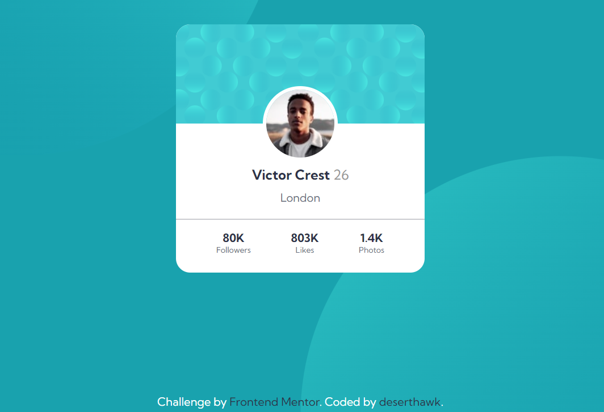

# Frontend Mentor - Profile card component solution

This is a solution to the [Profile card component challenge on Frontend Mentor](https://www.frontendmentor.io/challenges/profile-card-component-cfArpWshJ). Frontend Mentor challenges help you improve your coding skills by building realistic projects. 

## Table of contents

- [Overview](#overview)
  - [The challenge](#the-challenge)
  - [Screenshot](#screenshot)
  - [Links](#links)
- [My process](#my-process)
  - [Built with](#built-with)
  - [What I learned](#what-i-learned)
- [Author](#author)

## Overview

### The challenge

- I built the project according to the designs provided

### Screenshot

### Links

- Solution URL: [Solution URL](https://www.frontendmentor.io/solutions/flexbox-profile-card-component-0m7pd384v)
- Live Site URL: [Live URL](https://deserthawk.github.io/profile-card-component/)

## My process

### Built with

- Semantic HTML5 markup
- CSS custom properties
- Flexbox

### What I learned

In this project i practice style of background. I used before and after properties for double background images. Change their position with absolute the top and left positions. To hide the scrollbar is use overflow:hidden property.

## Author

- Frontend Mentor - [@yourusername](https://www.frontendmentor.io/profile/deserthawk)